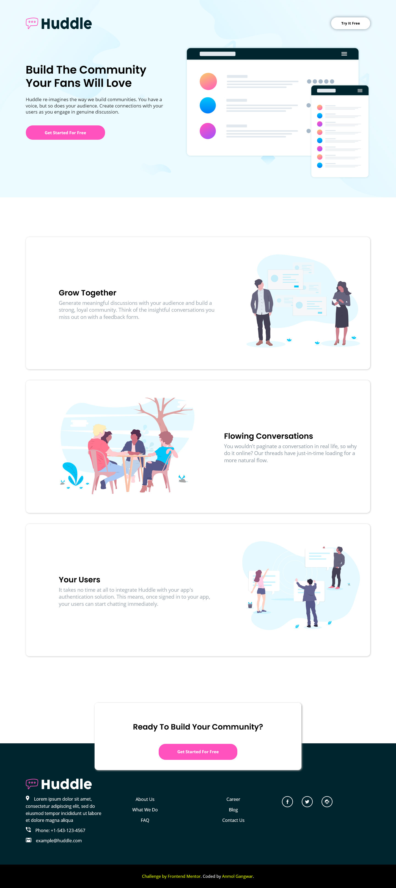
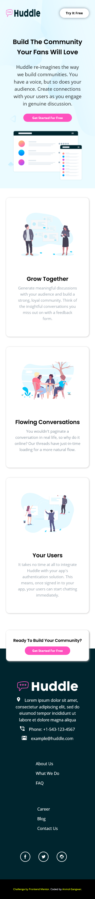

# Frontend Mentor - Huddle landing page with alternating feature blocks solution

This is a solution to the [Huddle landing page with alternating feature blocks challenge on Frontend Mentor](https://www.frontendmentor.io/challenges/huddle-landing-page-with-alternating-feature-blocks-5ca5f5981e82137ec91a5100). Frontend Mentor challenges help you improve your coding skills by building realistic projects.

## Table of contents

- [Screenshot](#screenshot)
- [Links](#links) -[Bulitwith](#Builtwith)
- [Author](#author)

### Screenshot

### Links

- Solution URL: [Add solution URL here](https://github.com/Robin-Anmol/huddle-landing-page)
- Live Site URL: [Add live site URL here](https://robin-anmol.github.io/huddle-landing-page//)

### Built with

- Semantic HTML5 markup
- CSS custom properties
- Flexbox

## Author

- Frontend Mentor - [@Robin-Anmol](https://www.frontendmentor.io/profile/Robin-Anmol)
